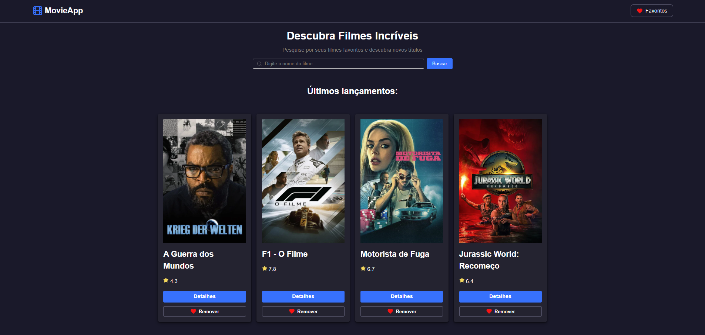
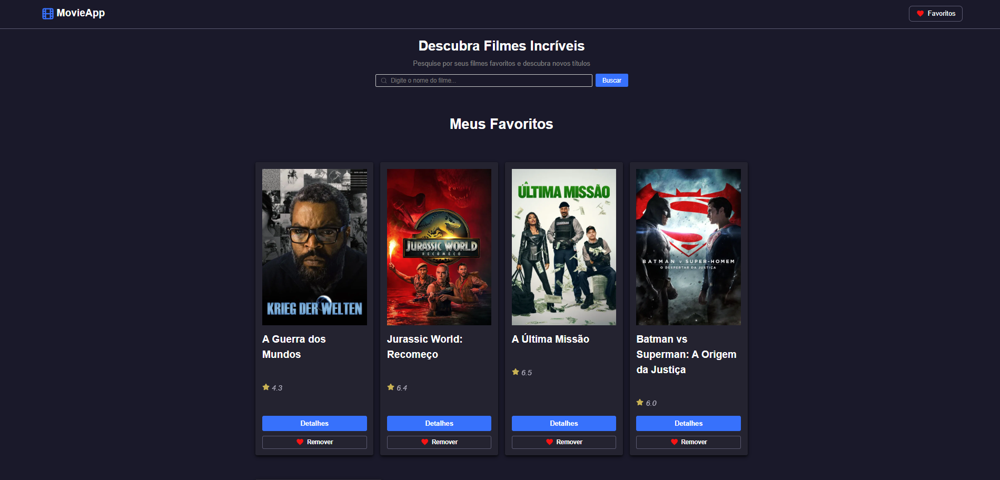

# 🎬 Filmes IMDB – Atividade 5 +pra TI

Aplicação em React + Vite que consome a API do TMDB (ou OMDb), permitindo que usuários busquem filmes, vejam detalhes e montem uma lista de favoritos.

Projeto criado durante o curso +praTi & Codifica Edu.

## Funcionalidades

### Busca de filmes: campo para pesquisar filmes pelo nome
### Resultados de Busca: exibição de pôster, título, nota, botão para detalhes e favoritar.
### Paginação: navegação entre múltiplas páginas de resultados.
### Página de Detalhes: informações completas como diretor, elenco, sinopse e avaliação.
### Lista de Favoritos: adicionar ou remover filmes com persistência no localStorage.
### Feedback de Estado: indicador de carregamento e mensagens de erro amigáveis.


### Tecnologias Utilizadas

React
 + Vite

React Router

TMDB API
 ou OMDb API

CSS Modules

## Estrutura do Projeto

```bash
┣ 📂public
┃ ┗ 📜vite.svg
┣ 📂src
┃ ┣ 📂assets
┃ ┃ ┗ 📜react.svg
┃ ┣ 📂components
┃ ┃ ┣ 📂MovieCard
┃ ┃ ┃ ┣ 📜index.jsx
┃ ┃ ┃ ┗ 📜MovieCard.module.css
┃ ┃ ┗ 📂Search
┃ ┃   ┣ 📜index.jsx
┃ ┃   ┗ 📜Search.module.css
┃ ┣ 📂contexts
┃ ┃ ┣ 📜FavoritesContext.js
┃ ┃ ┗ 📜FavoritesProvider.jsx
┃ ┣ 📂hooks
┃ ┃ ┗ 📜useFavorites.js
┃ ┣ 📂layout
┃ ┃ ┣ 📜MainLayout.jsx
┃ ┃ ┗ 📜MainLayout.module.css
┃ ┣ 📂pages
┃ ┃ ┣ 📂FavoritesPage
┃ ┃ ┃ ┣ 📜FavoritesPage.module.css
┃ ┃ ┃ ┗ 📜index.jsx
┃ ┃ ┣ 📂Home
┃ ┃ ┃ ┣ 📜Home.module.css
┃ ┃ ┃ ┗ 📜index.jsx
┃ ┃ ┣ 📂MovieDetails
┃ ┃ ┃ ┣ 📜index.jsx
┃ ┃ ┃ ┗ 📜MovieDetails.module.css
┃ ┃ ┗ 📂SearchPage
┃ ┃   ┣ 📜index.jsx
┃ ┃   ┗ 📜SearchPage.module.css
┃ ┣ 📂routes
┃ ┃ ┗ 📜AppRoutes.jsx
┃ ┣ 📂styles
┃ ┃ ┗ 📜globals.css
┃ ┗ 📜main.jsx
┣ 📜.env
┣ 📜.gitignore
┣ 📜eslint.config.js
┣ 📜index.html
┣ 📜package.json
┣ 📜README.md
┗ 📜vite.config.js
```

## Como Rodar o Projeto

1. Clone este repositório:
```bash
git clone https://github.com/EliamFuentes/atividade_05_API
```
2. Entre na pasta do projeto:
```bash
cd atividade_05_api
```
3. Instale as dependências:
```bash
npm install
```
4. Crie um arquivo .env na raiz com sua chave da API:
```bash
VITE_API_KEY=sua_chave_aqui
VITE_API_URL=https://api.themoviedb.org/3
```
5. Rode o projeto:
```bash
npm run dev
```

6. Acesse no navegador:
```bash
http://localhost:5173/
```
## Demonstração


